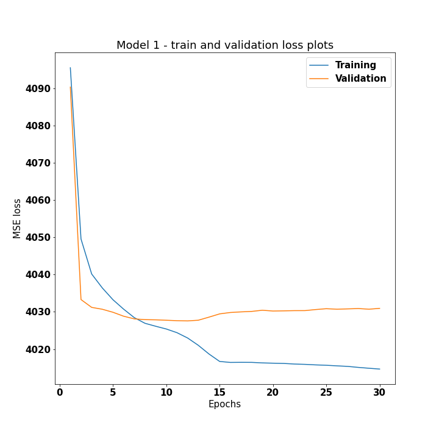
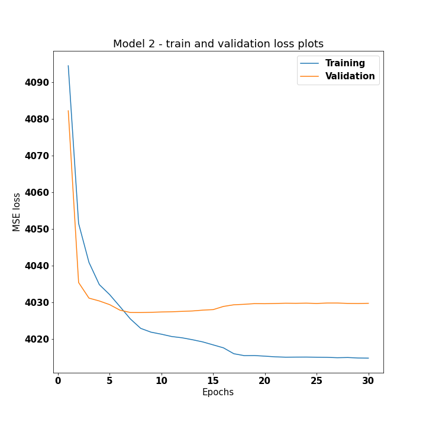
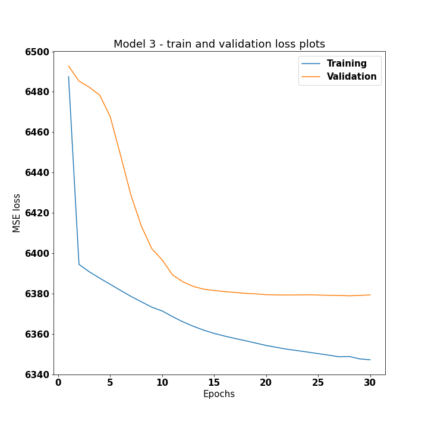
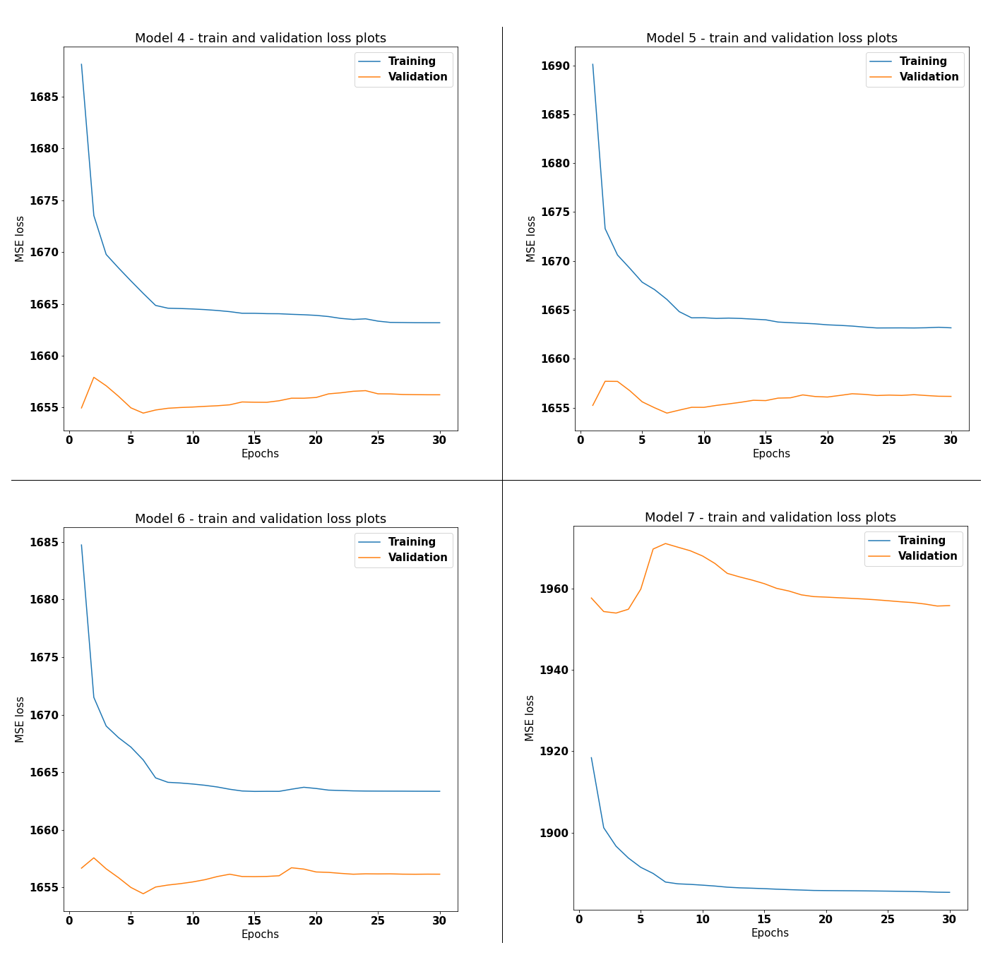
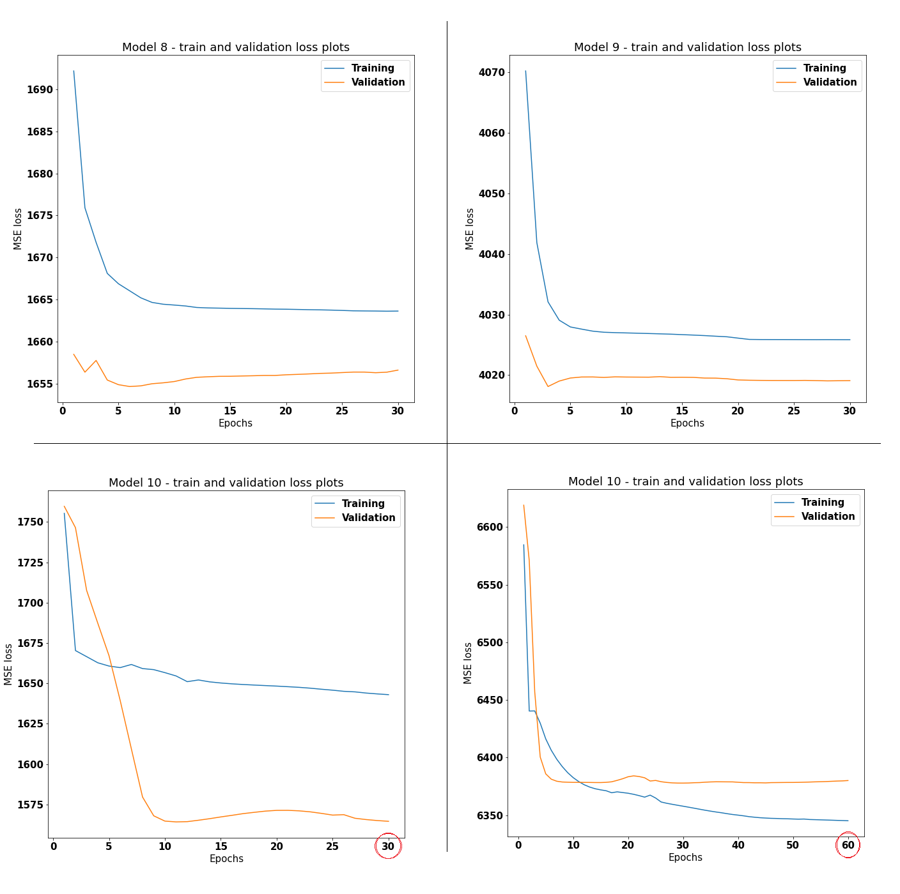
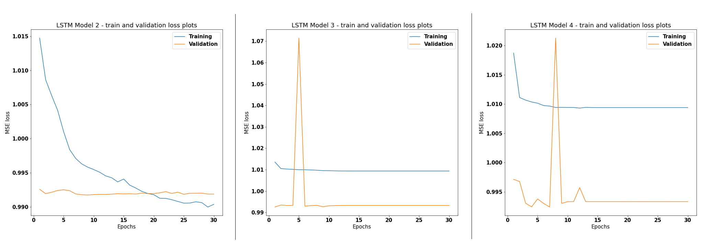
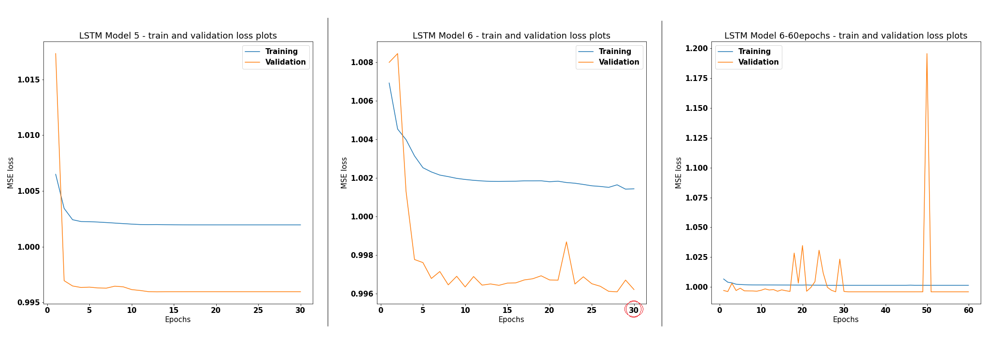

# Report Project Mines ML 2020 -  Apply DL model for Traffic Volume prediction

Author: Hiba Najjar

## Overview

Traffic data used for this project was collected from the several Wavetronix radar sensors deployed by the City of Austin between 2017 and 2019. Dataset is augmented with geo coordinates from sensor location dataset.

The main objective is to use deep learning models to predict the traffic volume. In the following, we start by applying some data analysis to explore different features in our data and exhibit correlation between volume and other variables, then apply to types of DL architectures and several models to predict traffic volume.

## Data exploration

([Link](https://www.kaggle.com/vinayshanbhag/radar-traffic-data) to the Kaggle Dataset of *Radar Traffic Data*)

We'll be working on a dataframe of **12** columns and **4.6M** records.

-  3 location columns: location name, longitude and latitude, with 18 different locations in total;
- 7 date columns: Year, Month, Day, Day of the Week, Hour, Minute and Time. No missing value was detected in these columns.
 
- a column for the directions, (SB, NB, EB, WB), with 5.6% of missing values: 

|    SB   |    NB   |   EB   |   WB   |  NaN  |
|:-------:|:-------:|:------:|:------:|:------:|
| 2 035 591 | 1 714 696 | 328 580 | 262 926 | 262 068 |

- and finally the Volume column, or number of vehicles detected by the sensor, in the last 15 minutes:

|   count   |    mean   |    std    | min |  25% |  50% |  75%  |  max  |
|:---------:|:---------:|:---------:|:---:|:----:|:----:|:-----:|:-----:|
| 4 603 861 | 71.17 | 63.70 | 0 | 13 | 56 | 115 | 255 |

## Can we use PCA to fill missing Direction values ?

Inspired by this [article](https://towardsdatascience.com/pca-using-python-scikit-learn-e653f8989e60), we will use PCA to reduce dimension of our data and draw scatter plots on the two principal components of our records, using the `Direction` variable as a color factor :

The results show that this approach may not be the best to impute the missing values. Other methods can solve this problematic, but for the rest of this projet we will simply drop records with missing values.

## Predictors Selection

Not all the columns we have in our original dataset are necessarly useful for our Volume Prediction task. Therefore, we will first look into correlation between variables, and then examine boxplot  of Volume values grouped by all categorical variables:  

Looking at **Volume-Date** boxplots, it would be reasonable to only keep `Hour`, `Month` and `Day of Week` predictors, and for the **Location** variables, we'll use `location_name` only. We will also update the value of `Minute` using the the `Time Bin` variable before we get ride off it.

Therefore, our data will be composed of the following categorical variables:
|       Varibale       | Location Name | Direction | Month | Day of the Week | Hour | Minute |
|:--------------------:|:-------------:|:---------:|:-----:|:---------------:|:----:|:------:|
| Number of categories |       16      |     4     |   12  |        7        |  24  |    4   |

Categorical variables will be divided into batches under an approriate representation ( stack of one-hot vector per categorical variable) for the training and test steps. Each input will be a 67 length vector if we keep all variables above.

## Models: RNN

The first model architecture that will be tested is a **Regression Neural Network** (RNN) of a few fully connected hidden layers and one unit in output layer. For this purpose we define two model classes `RNN`and later the `RNN2`, with 3 and 4 hidden layers respectively. We chose the Mean Squared Error as a loss function and the Adam optimizer.

The main hypermarameters are the number of units in each hidden layer `i`: `n_li` and the learning rate. we progressively set the hyperparameters to certain values and train the model, then plot the loss curve for the training and validation set. Interpreting this plots enables us to adjust the hyperparameters in order to improve the outcome, ensure an enough complex architecture and avoid overfitting all along.

### RNN model 1:

 - n_l1, n_l2, n_l3 = 128, 64, 32
 - learning_rate = 0.01 
 

**Interpretation**: Seems like we have a quick overfitting, we will reduce the number of units in the following model to make it less complex.

### RNN model 2:

 - n_l1, n_l2, n_l3 = 64, 32, 16 
 - learning_rate = 0.01 
 

**Interpretation**:  The convergence is still too fast and not satisfying. Before updating the learning rate, we will first narrow the predictors space, by keeping records of only one month (January) and location (**A** = *CAPITAL OF TEXAS HWY / LAKEWOOD DR*)

### RNN model 3:

 - n_l1, n_l2, n_l3 = 64, 32, 16 
 - learning_rate = 0.01 
 - data : January records of 
 

**Interpretation**:  The model enter overfitting around 15 epochs, we will bring back the month variable since to have a more fournished imput data, change the location to **F** = *100 BLK S CONGRESS AVE (Congress Bridge)* and add complexity to the model.

### RNN models 4-5-6-7:
We tried making the one month-location models better by adding hidden units but in vain, thats why in models 4-7 we turn back to using records from different months, but for the specific F location: 

 - change the location : model 4
 - then add double the number of hidden units: model 5
 - go back to split to half the number of units in model 4: model 6
 - use records from a specific direction only: model 7

 

**Interpretation**:  None of the models are satisfying, nor is it easy to interpret the results (scaling problem). In the following, we will modify the class function of the model to `RNN2` which has an additional hidden layer.

### RNN2 models 8-9-10

 - In model 8, we disrgard the direction and keep records of location F only; 
  - In model 9 we disregard direction again but use all locations, and add more hidden units and train on more data; 
  - In model 10, we drop the direction and keep records of location A and month of January only, then train the model for 30 additional epochs.

 

The results are from our expectations. There are many issues with this section, namely the variability of the value we want to predict are high, it's better to standardize the Volume column before training, and Regression Neural Models may simply not be the best choice to predict traffic volume values, we couldn't even select a model out those we trained to evaluate it on the test set.

Alternatively, we can make use of the time series, we can extract from the data and design models with a more adapted architecture.

## Models: LSTM on Time Series

In this section, we will use LSTM to predict traffic Volume. Time series will be created for each (location_name, direction) tuple and sorted using the year, month, day and time bin variables. Volume column will also be standarized. The following models were trained on the tuple (F, SB), using 10 000 records for training, 6 000 for validation and eventually model selection, and the rest for testing. Total number of training epochs is 30 with a batch-size equal to 32;

### LSTM model 1:

For this first model, the hyperparameters are:

 -  sliding window width = 20
 - LSTM layers = 2
-  LSTM units = 16
-  LSTM dropout = 0
-  FC layer units = 32
-  Learning rate = 0.01

The model is crearly enable to generalize. We will increase the sliding window's width in the following.

### LSTM models 2-3-4

The sliding window in the three models is now up to 40 elements. In model 3 we make the model more complex, and in model 4 we only add dropout to the second model.

Models 3 and 4 converge too fast, while model 2 doesn't generelize its learning to the validation set, despite the fact that records were  carefully shuffled.

### LSTM models 5-6
In these two models we increase the sliding window to 100. The lr in model 5 is equal to 0.01 and in model 6 we set  lr=0.005.

Even with slower and longer learning, we can observe how the model doesn't improve much.

## Conclusion

If we had to select a model, it would rather be the second LSTM architecture. Of course we would still have to evaluate it on the test set, but comparing RNN and LSTM models, we can observe how working on the same training dataset and with standarized values made comparison more feasible between LSTM models. With enough computational and parallelism capacities, we could have tried use full records, since it's one of the best techniques to avoid overfitting but also to enable our model to train on larger variety of input patterns.

## References

[Medium: Regression with Neural Networks in PyTorch](https://medium.com/@benjamin.phillips22/simple-regression-with-neural-networks-in-pytorch-313f06910379)

[Stack Abuse : Time Series Prediction using LSTM with PyTorch in Python](https://stackabuse.com/time-series-prediction-using-lstm-with-pytorch-in-python/)

[Medium: PyTorch LSTMs for time series forecasting of Indian Stocks](https://medium.com/analytics-vidhya/pytorch-lstms-for-time-series-forecasting-of-indian-stocks-8a49157da8b9)

